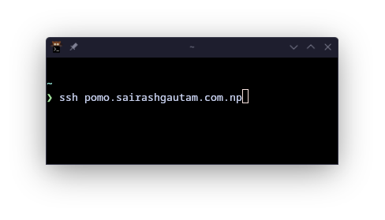

# Pomo SSH 

A __`Terminal Pomodoro Application`__.

[Official Website](https://pomo.sairashgautam.com.np)


To use the application:
``` sh
ssh pomo.sairashgautam.com.np
```

<br/>
<br/>


     [](https://goreportcard.com/report/github.com/sairash/pomossh) 


Introducing a fresh take on productivity, a unique Pomodoro Timer app designed specifically for the terminal enthusiasts and tech-savvy professionals.

This minimalist design keeps your focus on tasks without the clutter of traditional apps.


---

__Visual Options:__

Visual Effects are the visual aspects of the timer to make every sessions intresting. Here are some of the available visual options. 


<details open>
<summary>🌲 Tree</summary>
<br>


A random procedurally generated tree everytime you start a session.
</details>

<details open>
<summary>🛶 Flow</summary>
<br>


A guy who is rowing through the _"Time River"_.
</details>


<details open>
<summary>☕ Coffee</summary>
<br>


A coffee mug that filles up over time.
</details>


--- 


### How to use Pomossh:

__STEP [1]:__

Run the following comamnd in your terminal



__STEP [2]:__

Enter the time in minutes and also session "Title"


__STEP [3]:__

Select a visual option for the session


__STEP [4]:__

Work!


----


### How to install Pomossh locally:

To install pomossh locally run the following command.

__Linux/MAC:__

``` sh
curl -sSL https://gist.githubusercontent.com/sairash/f07c0d194c755fdd6c4fe39d0010ec30/raw | bash
```

__Windows:__

``` sh
curl -sSL https://gist.githubusercontent.com/sairash/d6ce0c6a627f932dd105f17209d1b0e2/raw/20c42bfbafb09bf495cda7a77fe33fcab0055e6a/install_pomo.ps1 | powershell -c -
```


Or use it directly


``` sh
git clone https://github.com/sairash/pomossh
```

``` sh
cd pomossh
```

``` sh
go build
```

And,

__Run pomossh as client:__
```sh
pomossh
```

__Run pomossh as server:__
```sh
pomossh -ssh true
```