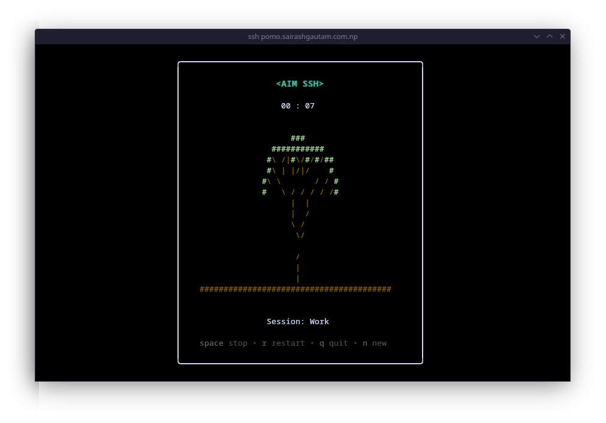

# Aim SSH
Mulitple Productive __`Terminal SSH Application`__.

[Official Website](https://aim.ftp.sh)


To use the application:
``` sh
ssh aim.ftp.sh
```

<br/>
<br/>


     [](https://goreportcard.com/report/github.com/sairash/aimssh) 





Introducing a fresh take on productivity, a unique terminal productivity app designed specifically for the terminal enthusiasts and tech-savvy professionals.

This minimalist design keeps your aim on tasks without the clutter of traditional apps.

### Planned and Added
- ✅ Timer
- ❌ Todo List similar to todist
- ❌ Notes Taking
- ❌ Stats


---

__Visual Options:__

__Note:__ The screenshots are before the rebranding (Updating soon)


Visual Effects are the visual aspects of the timer to make every sessions intresting. Here are some of the available visual options. 


<details open>
<summary>🌲 Tree</summary>
<br>


A random procedurally generated tree everytime you start a session.
</details>

<details open>
<summary>🛶 Flow</summary>
<br>


A guy who is rowing through the _"Time River"_.
</details>


<details open>
<summary>☕ Coffee</summary>
<br>


A coffee mug that filles up over time.
</details>


--- 

### How to use aimssh:

__STEP [1]:__

Run the following comamnd in your terminal


__STEP [2]:__

Enter the time in minutes and also session "Title"


__STEP [3]:__

Select a visual option for the session


__STEP [4]:__

Work!


----


### How to install aimssh locally:

To install aimssh locally run the following command.

__Linux/MAC:__

``` sh
curl -sSL https://gist.githubusercontent.com/sairash/f07c0d194c755fdd6c4fe39d0010ec30/raw | bash
```

__Windows:__

``` sh
curl -sSL https://gist.githubusercontent.com/sairash/d6ce0c6a627f932dd105f17209d1b0e2/raw/20c42bfbafb09bf495cda7a77fe33fcab0055e6a/install_pomo.ps1 | powershell -c -
```


Or use it directly


``` sh
git clone https://github.com/sairash/aimssh
```

``` sh
cd aimssh
```

``` sh
go build
```

And,

__Run aimssh as client:__
```sh
aimssh
```

__Run aimssh as server:__
```sh
aimssh -ssh -host 0.0.0.0 -port 13234
```

__or__
```sh
aimssh -ssh=true -host=0.0.0.0 -port=13234
```
<br/>

Made With ❤️ by <a href="https://sairashgautam.com.np" target="_blank" class="border-b-2 text-[#CFF27E]" rel="noopener noreferrer">Sairash</a>.
